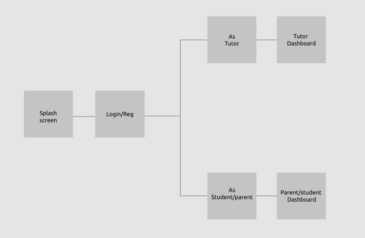
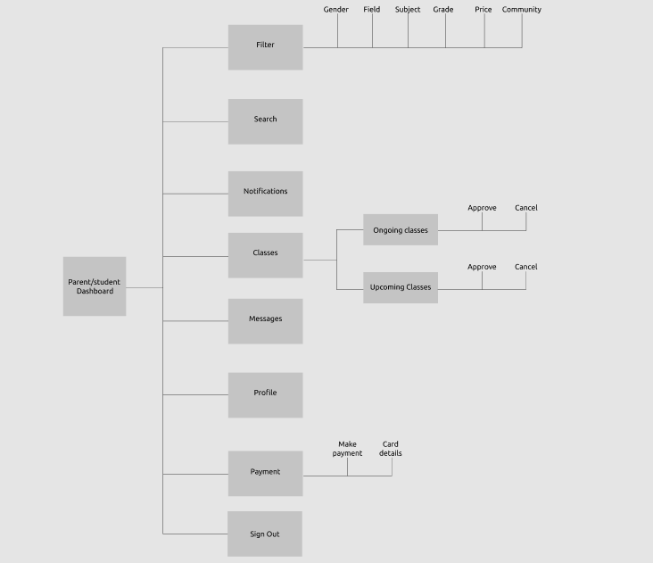

  

 # HomeTeach 

## App Description
HomeTeach software provides a platform for experienced teachers in the society to register and retail their services. The concept of the app is inspired by the imperative need to take education into the digital stratosphere. It seeks to create a platform where parents (or students) can seek for tutors with professional experience for their wards (or themselves).
Teachers register and the organization screens them to ensure the necessary standards are met. Parents (or students) can subscribe, log in and select their subject and are able to choose a teacher from the list of available teachers. Arrangements for classes are made and the subscriber will be debited at month ends. Subscribers are able to rate/feedback teachers on the app so that future subscribers can be guided on their choice.
HomeTeach develops a robust paid learning experience for students with education level put in place and matched with the right tutor. Running on a subscription system, parents pay for expert knowledge, tutors get paid for services rendered, further reducing bottlenecks associated with these services outside the digital enviroment.

## App Flow

  

When the App is launched, the user is presented with the Splash screen, immediately followed by the OnBoarding Screens; the user can decide to skip the OnBoarding by tapping the Skip text; on the last OnBoarding screen, the user taps the displayed button to move to the Explore Screen. On the Explore screen, the user can tap a Button to choose if he's a Tutor or a Student, then he navigates to the Log in/Registration Screen. As a new user, he is expected to input his full name, email, phone number, password and agree to the terms and conditions (as an existing user, he can proceed into the App by simply loging in with his email and password. If an existing user forgets his password, he can recover it using email or phone number); then the user is taken to the appropriate dashboard depending on thr type of user (Tutor or Student/Parent)

  

From the Dashboard;

* The User as a Tutor can edit his profile to put in all his details like description, picture, video, subjects taught, location address, rate charged and credentials. The Parent/student can also navigate to edit his their profile by adding a description about them.

* As a Parent/student, the user can search for tutors or subject taught by them; from the search result, the user can run a filter based on gender, field, subject, grade, pricing and community. After which they can view the Tutor details and request for the service of any Tutor of their choice.

* The user can navigate to view the list of notifications gotten.

* The user can navigate to view the list of classes; either requests made or ongoing classes. From the requests, the user can either approve/confirm or cancel the request.

* The user can navigate to view the message screen where the Tutor can chat with the parent/student to seal deals or for any other reason.

* The Parent/student can navigate to make payment into their account with their credit card.

* The user can also navigate to the Preference/Settings screen to change the settings of the app as preferred; from there, they can edit profile, view privacy and safety, set the way notification is received, change the display settings, the language of choice, accessibility and view more details about the App.

* The user can Sign out of the current session.

## Contributing 
* Fork the repository.
* Clone the forked repository into your local machine using `git clone https://github.com/your-username/mobileforce-HomeTeach.git`
* Checkout to a new branch (branches are to be named using this convention, `feat/login`) before you start working using `git checkout -b name-of-branch`. 
* Work on the cloned repository and add your changes using `git add .`
* Commit the changes using `git commit -m "commit message"`.
Your commit message should be as brief as possible.
Example: git commit -m "feat: Login Layout"
* Push to your the remote branch.
* Finally, from your forked repository, create a pull request into the `develop` branch of the team repository.
Your Pull Request should include a link to your clubhouse story and also tell also something about the changes made, to help PR testers.
Goodluck guys.
